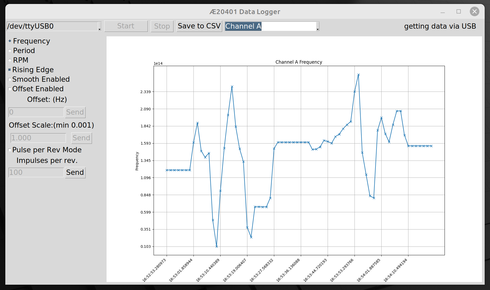

# AE20401-logger
Graph and record data from an Ascel Æ20401 over USB

This is a very simple serial interface for the USB output of the Æ20401 AE20401 5.8 GHz Frequency Counter / RF Power Meter from Ascel Electronic [https://www.ascel-electronic.de/kits/14/ae20401-5.8-ghz-frequency-counter/rf-power-meter]

The code should be portable since it is pure python.  It has been written and tested under linux since the manufacturer supplied software is windows native.

The system has basic logging functionality.  Let me know if you see this project and are interested.

Extensions that might be fun:

* A automation script interface to allow you to monitor different inputs remotely (e.g. Channel A for 30s, Power for 30s, sleep 1hour... etc)
* Control other devices?  It should be possible to interrogate the device and establish what it is, then load GUI's that are appropriate (alot of this is already implemented as the device changes between channel A, B, Power etc.
* Better abstraction - Device could define the interface and how to interact - huh... that'd be fun!
